# 实验一：OpenWrt虚拟机的搭建及无线网卡使用

## 实验目的

+ 熟悉基于 OpenWrt 的无线接入点（AP）配置
+ 为第二章、第三章和第四章实验准备好「无线软 AP」环境

## 实验要求

- [x] 无线路由器/无线接入点（AP）配置的功能清单，找到在 OpenWrt 中的配置界面并截图证明；

- [x] 记录环境搭建步骤；

- [x] 如果 USB 无线网卡能在 OpenWrt 中正常工作，则截图证明；

    如果 USB 无线网卡不能在 OpenWrt 中正常工作，截图并分析可能的故障原因并给出可能的解决方法。

## 实验设备

+ 可以开启监听模式、AP 模式和数据帧注入功能的 USB 无线网卡【Atheros AR9271】
  
  

## 实验过程

### 虚拟机搭建

首先下载19.07.5版本的镜像文件：

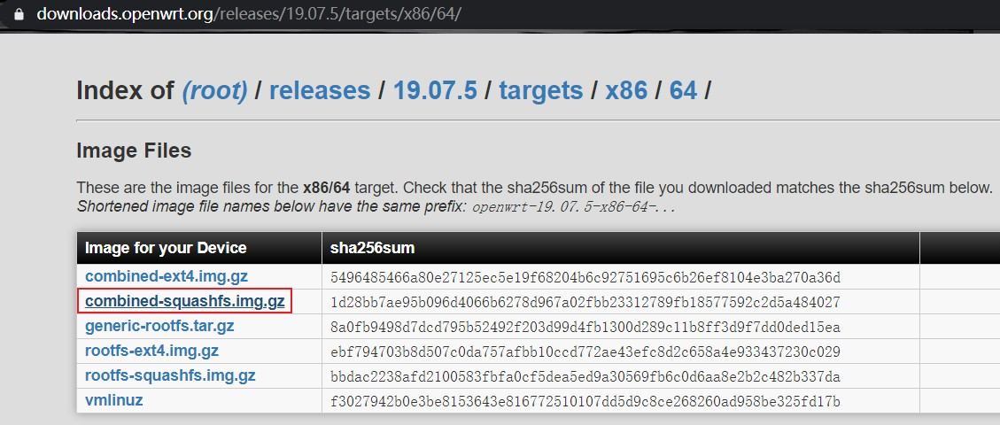

下载完后解压缩，将文件名改为 openwrt-x86-64-combined-squashfs.img 。接着在命令行执行命令：

`VBoxManage convertfromraw --format VDI openwrt-x86-64-combined-squashfs.img openwrt-x86-64-combined-squashfs.vdi`

将其转换为vdi格式：

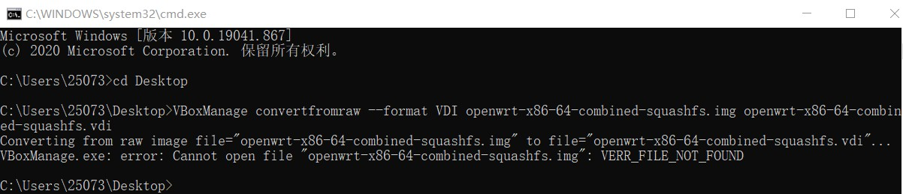

发现出现错误，查阅资料后得知需执行 `dd if=openwrt-x86-64-combined-squashfs.img of=openwrt-x86-64-combined-squashfs-padded.img bs=128000 conv=sync conv=sync` 指令修复一下镜像，转到git bash中执行：

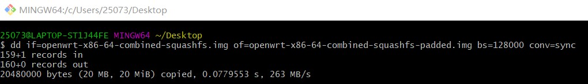

接着继续将其转换为vdi格式：

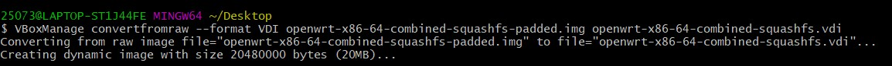

成功。然后以此建立新的虚拟机：

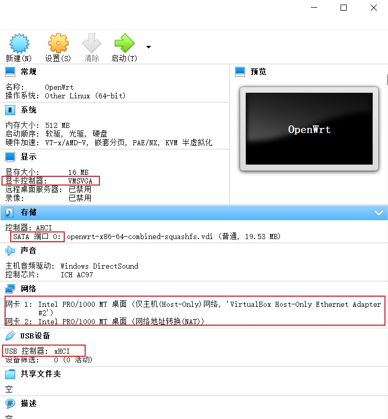

### 网络配置

进入虚拟机后首先配置网络：

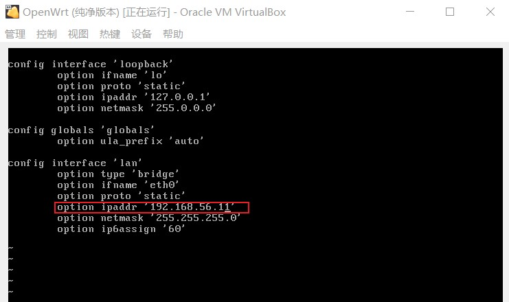

配置完毕以后重启eth0网卡，但发现无法联通网络，观察后推测是用于上网的网卡2没有启动：

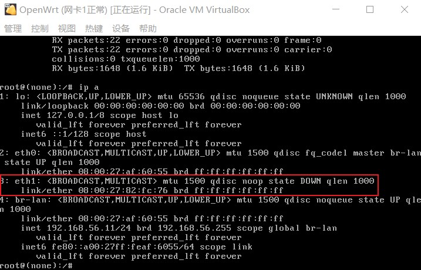

手动在网络配置上添加如下规则：

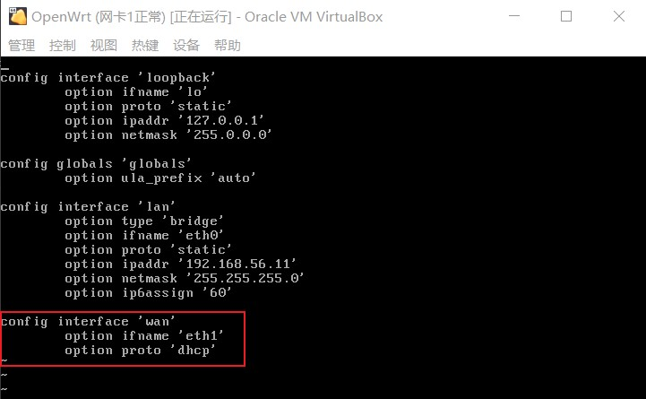

重启eth1网卡后网络联通成功：

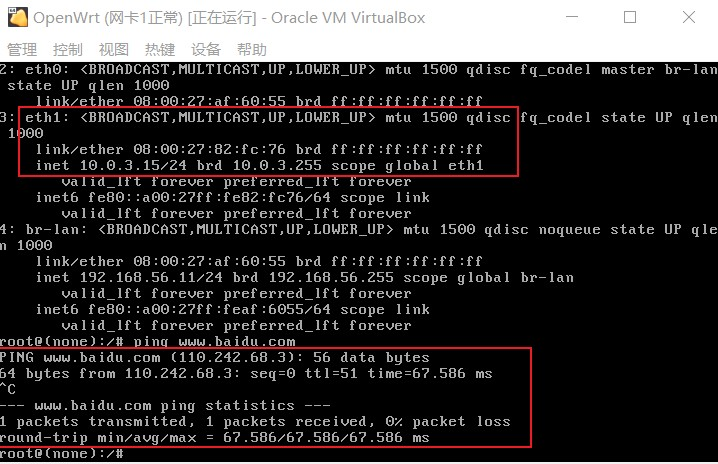

### 安装驱动

安装 LuCi 软件包：

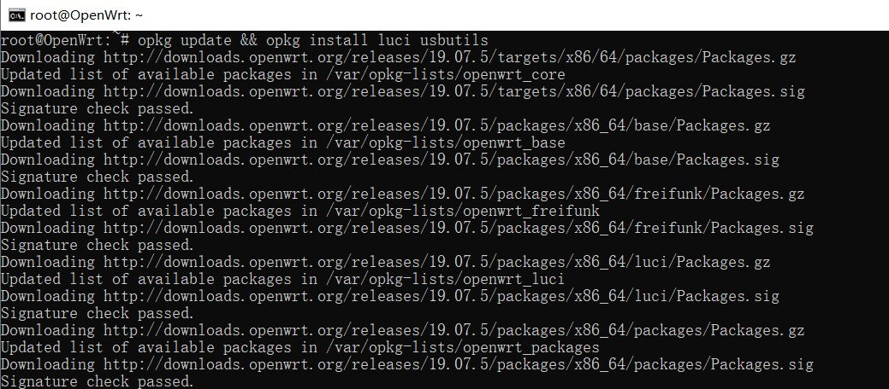

查看 USB 外设的标识信息：

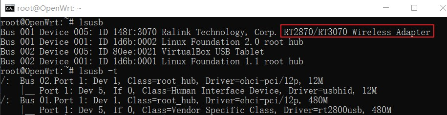

根据命令`opkg find kmod-* | grep 2870`，查询到了该网卡的驱动程序包名为`kmod-rt2800-usb`，安装驱动：

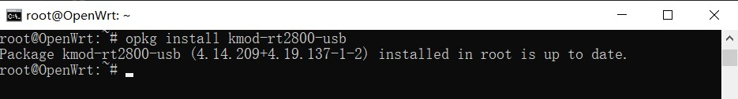

用iw命令查看设备信息：

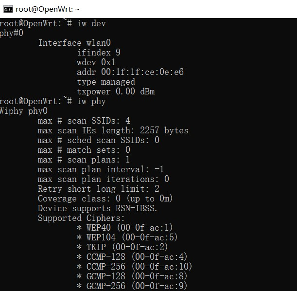

### 登录LuCi网页端成功

在浏览器导航栏输入地址：192.168.56.11，进入web管理界面

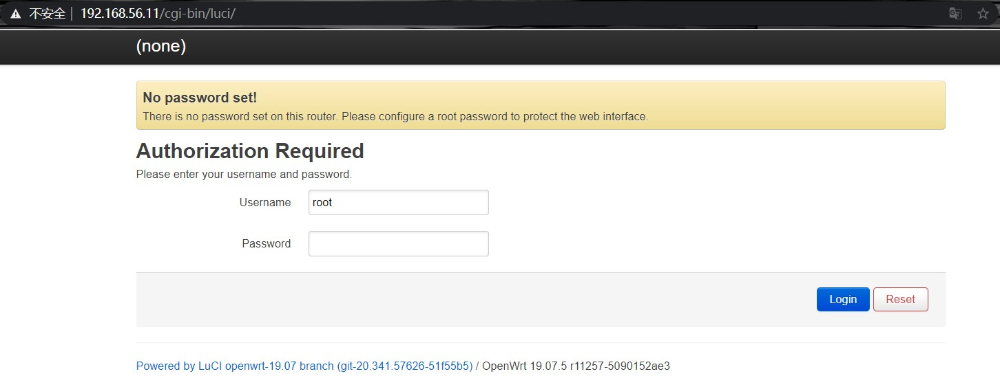

随意输入一个密码，成功登录网页界面

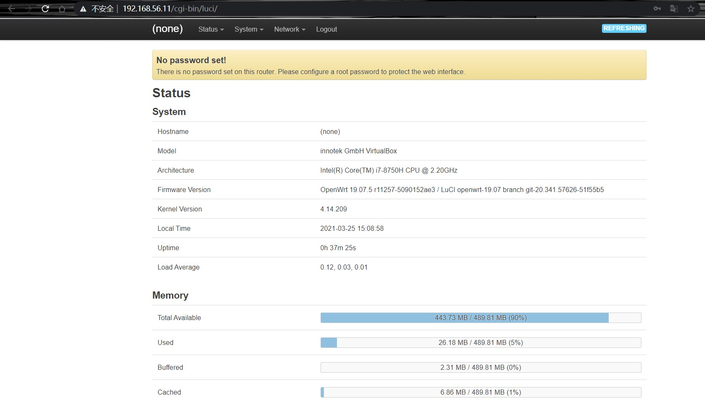

### 开启AP功能

在无线网卡和驱动配置好后，登录浏览器端，进入 Wireless 界面：

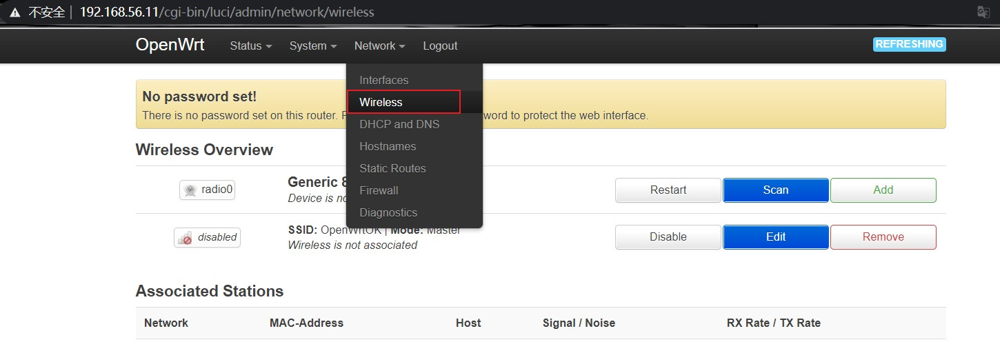

在 NetWork 选项中选择 wan ：

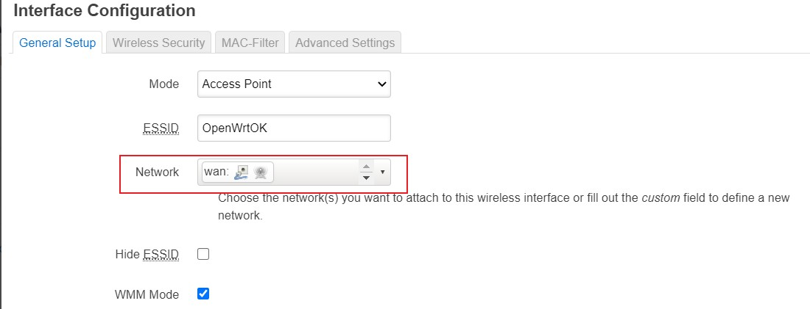

手工指定信道选择和信号强度：

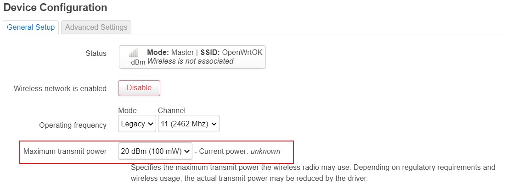

无线网卡编辑完成后启用网卡，这是没有客户端加入当前无线网络时的状态：

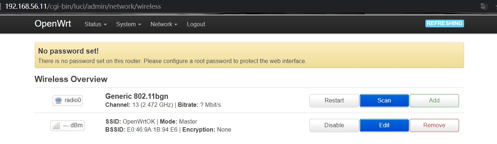

这是有客户端加入当前无线网络时的状态：

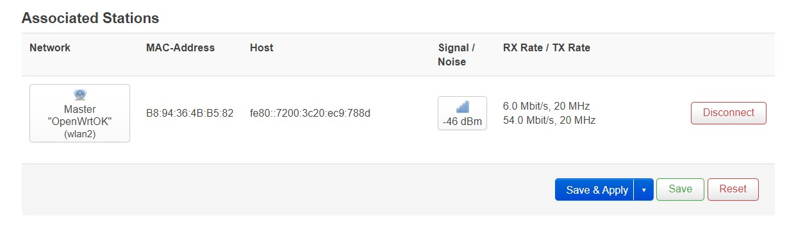

## 实验结果展示

### 无线路由器/无线接入点（AP）配置

- 重置和恢复AP到出厂默认设置状态

    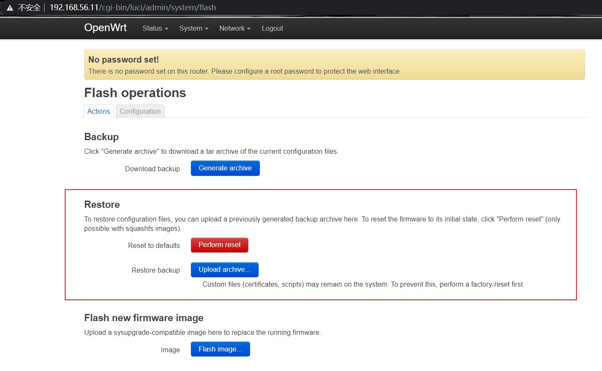

- 设置AP的管理员用户名和密码

    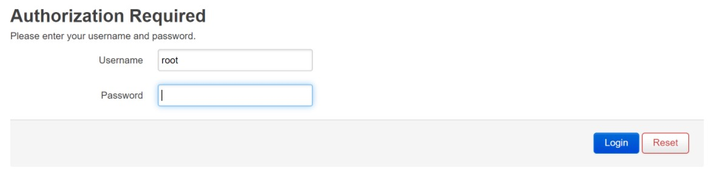

- 设置SSID广播和非广播模式

    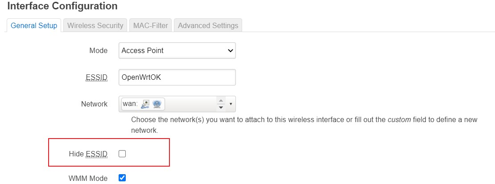

- 配置不同的加密方式

    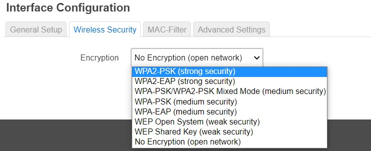

- 设置AP管理密码

    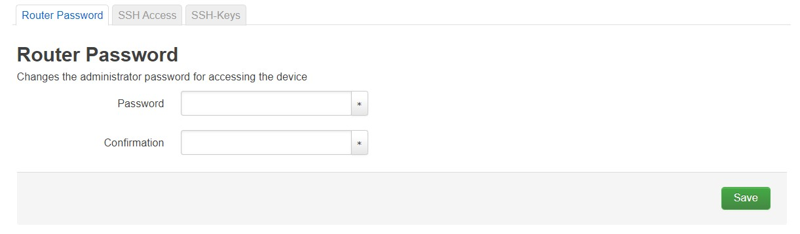

- 配置无线路由器使用自定义的DNS解析服务器

    

- 配置DHCP和禁用DHCP

    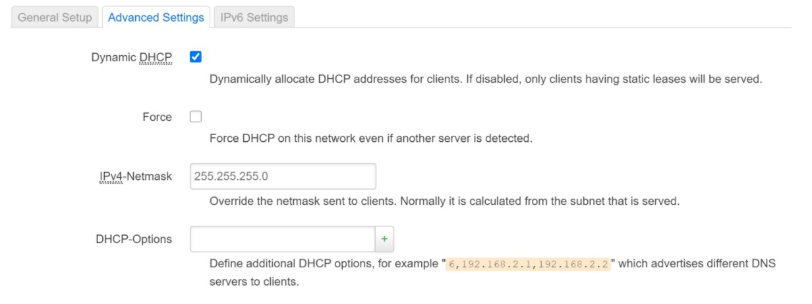

    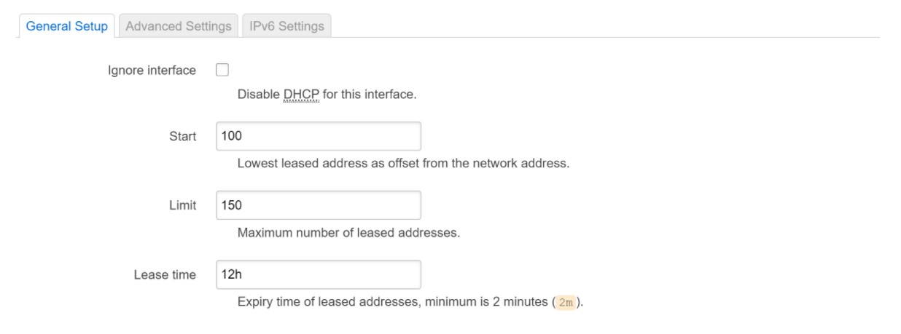

- 开启路由器/AP的日志记录功能（对指定事件记录）

    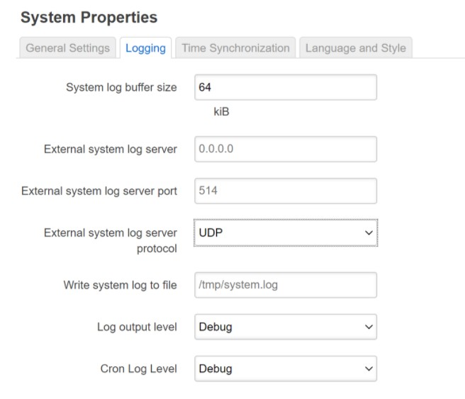

- 配置AP隔离(WLAN划分)功能

    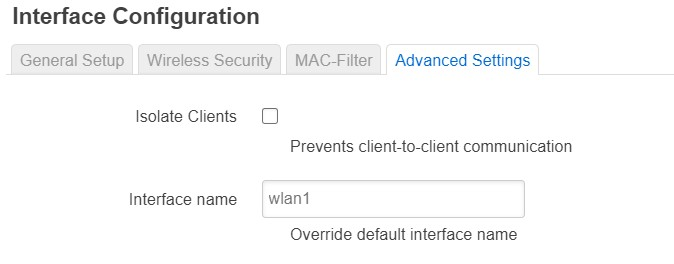

- 设置MAC地址过滤规则（ACL地址过滤器）

    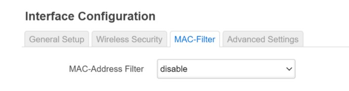

- 查看AP/无线路由器支持哪些工作模式

    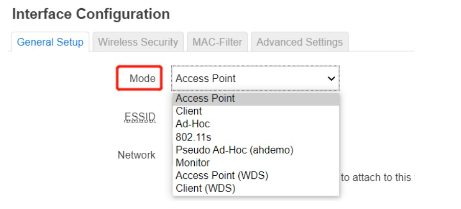

## 参考资料

+ [第一章 无线网络安全基础](https://c4pr1c3.github.io/cuc-mis/chap0x01/exp.html)
+ [在Virtualbox虚拟机中运行OpenWrt](https://openwrt.org/zh/docs/guide-user/virtualization/virtualbox-vm)